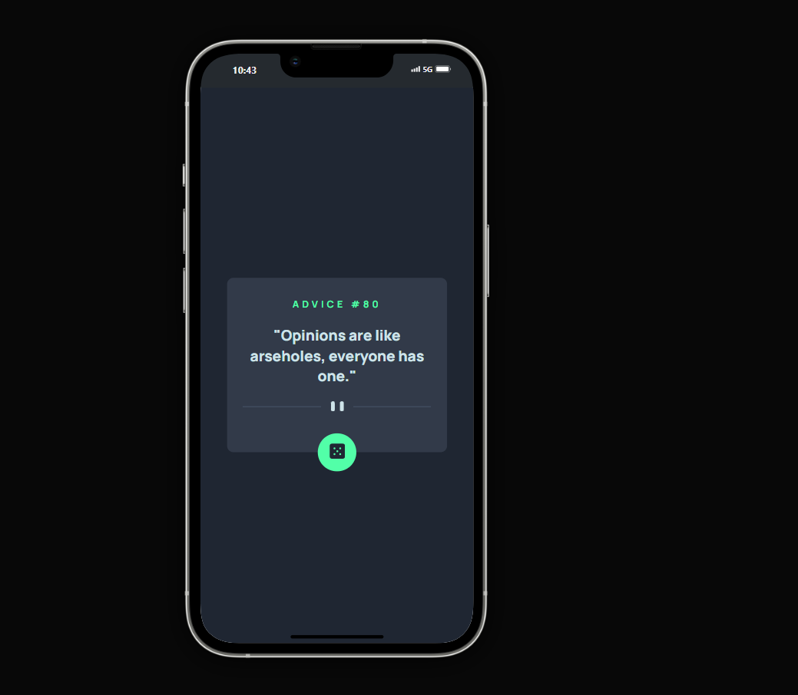

# Gerador de Conselhos 🎲👨‍💻

Este projeto é um Gerador de Conselhos que busca conselhos aleatórios de uma API a cada clique no botão.

Fetch API: Utilizado para fazer requisições HTTP para a API de conselhos e obter novos conselhos.

Try...Catch: Implementado para lidar com possíveis erros durante as requisições, garantindo que a aplicação continue funcionando mesmo em caso de falhas.

Botão Interativo: Um botão que, ao ser clicado, busca e exibe um novo conselho na tela.

## Demonstração:

 

## Tecnologias utilizadas:
- JavaScript
- CSS
- HTML
